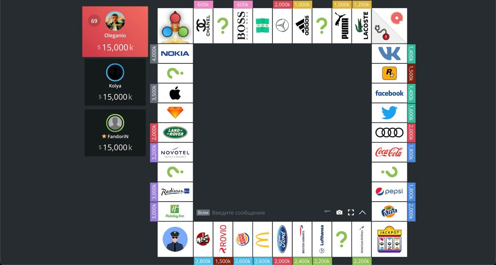
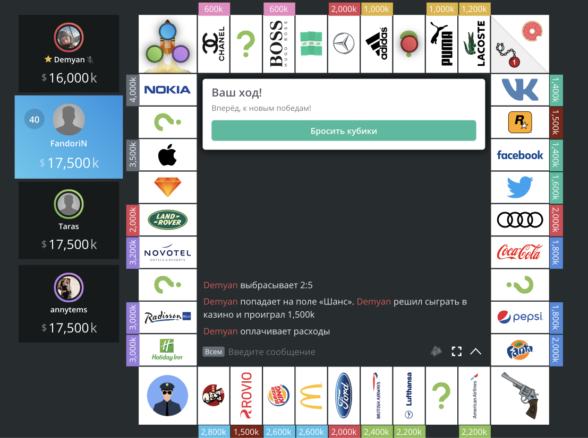
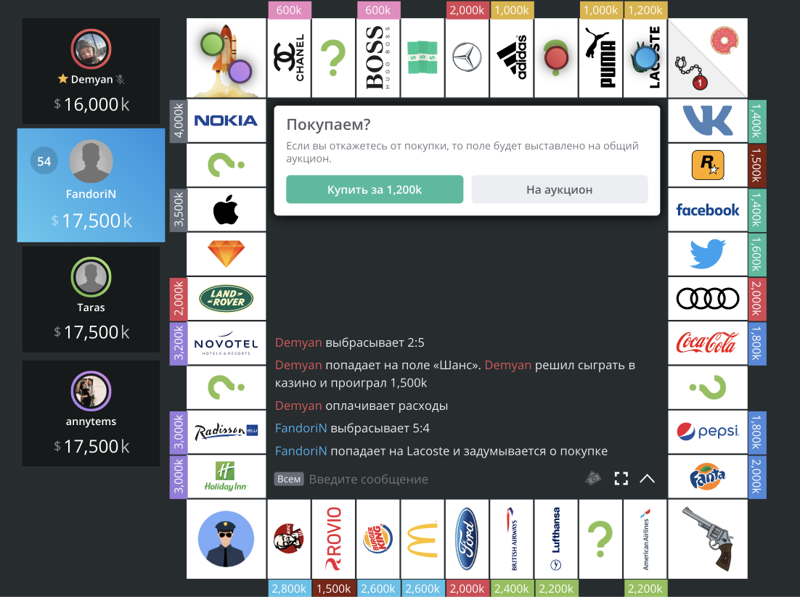
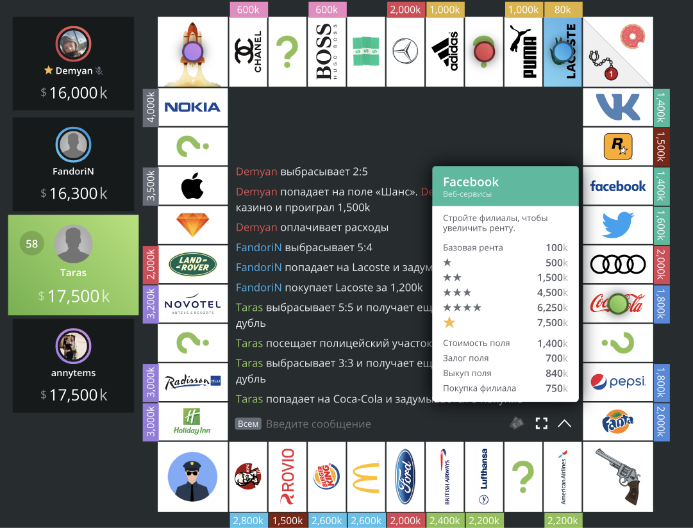

# Monopoly

<!-- ALL-CONTRIBUTORS-BADGE:START - Do not remove or modify this section -->

[](#contributors-)

<!-- ALL-CONTRIBUTORS-BADGE:END -->

[:us: / :uk: version](./README-EN.md)

## Как запустить

```
1. npx lerna bootstrap
2. npm install
3. npm start
```

Могут возникать ошибки при использовании новых версий npm и yarn, желательно не использывать следующие версии: npm 7, yarn 2

---

## Как я могу внести свой вклад?

Прочти пожалуйста это [руководство](./CONTRIBUTING.md)

---

## Список возможностей

- ✅ Создание игры
- ✅ Подключения игроков к сессии игры
- ✅ Игровое поле
- Просмотр данных о компании
- ✅ Бросок кубиков
  - В 3d
- ✅ Анимация перемещения фишек по доске
- Таймер на ограничение хода
- Действия с компаниями
  - Оплата аренды
  - ✅ Покупка компаний
  - Выставление компаний на аукцион
  - Заложение компаний
  - Выкуп компаний
  - Постройка филиалов
  - Продажа филиалов
- Предложение сделок
- Реализация ячеек
  - Старт
  - Тюрьма
  - Джекпот
  - Отпуск
  - Шанс
  - Налог
- Чат между игроками
- Логирование событий в чат
- Возможность сдаться

---

## Что мы хотим на вид

1. Начало игры
   

2. Предложение хода
   

3. Решение о покупки компании
   

4. Обзор компании при клике на ее ячейку
   

Эти скриншоты из https://monopoly-one.com/

Но есть еще https://monopolystar.ru/ и по мне она более ламповая, у каждой из них есть свои минусы по UX, мы же возьмем только лучшее из них обеих.

## Contributors ✨

Thanks goes to these wonderful people ([emoji key](https://allcontributors.org/docs/en/emoji-key)):

<!-- ALL-CONTRIBUTORS-LIST:START - Do not remove or modify this section -->
<!-- prettier-ignore-start -->
<!-- markdownlint-disable -->
<table>
  <tr>
    <td align="center"><a href="https://github.com/lFandoriNl"><br /><sub><b>Maxim Koylo</b></sub></a><br /><a href="https://github.com/lFandoriNl/monopoly/commits?author=lFandoriNl" title="Code">💻</a> <a href="https://github.com/lFandoriNl/monopoly/commits?author=lFandoriNl" title="Tests">⚠️</a> <a href="#data-lFandoriNl" title="Data">🔣</a> <a href="#ideas-lFandoriNl" title="Ideas, Planning, & Feedback">🤔</a> <a href="#projectManagement-lFandoriNl" title="Project Management">📆</a> <a href="https://github.com/lFandoriNl/monopoly/pulls?q=is%3Apr+reviewed-by%3AlFandoriNl" title="Reviewed Pull Requests">👀</a></td>
    <td align="center"><a href="https://github.com/NothingToSayLGFM"><br /><sub><b>NothingToSayLGFM</b></sub></a><br /><a href="https://github.com/lFandoriNl/monopoly/commits?author=NothingToSayLGFM" title="Code">💻</a></td>
    <td align="center"><a href="https://github.com/Extwazer"><br /><sub><b>Extwazer</b></sub></a><br /><a href="https://github.com/lFandoriNl/monopoly/commits?author=Extwazer" title="Code">💻</a></td>
    <td align="center"><a href="https://github.com/nevstafev"><br /><sub><b>nevstafev</b></sub></a><br /><a href="https://github.com/lFandoriNl/monopoly/commits?author=nevstafev" title="Code">💻</a> <a href="#ideas-nevstafev" title="Ideas, Planning, & Feedback">🤔</a></td>
    <td align="center"><a href="http://nchechulin.github.io"><br /><sub><b>Nikolay Chechulin</b></sub></a><br /><a href="#translation-NChechulin" title="Translation">🌍</a></td>
  </tr>
</table>

<!-- markdownlint-restore -->
<!-- prettier-ignore-end -->

<!-- ALL-CONTRIBUTORS-LIST:END -->

This project follows the [all-contributors](https://github.com/all-contributors/all-contributors) specification. Contributions of any kind welcome!
